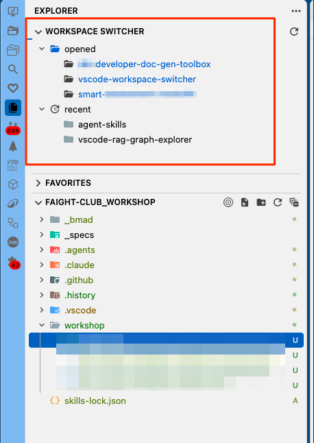

# Workspace Switcher

Adds a custom tree view section named **[Workspace Switcher](https://github.com/sguisse/vscode-workspace-switcher)** inside VS Code's Explorer sidebar.


## Overview

* The Workspace Switcher extension provides a convenient way to manage and switch between your opened and recent VS Code workspaces directly from the Explorer sidebar.
* It helps you keep track of your workspaces and quickly access the ones you need.
* See screenshots below for an overview of the extension:
  * 

## Features

- Displays workspaces in **opened** and **recent** groups.
- Sorts each group newest-first and highlights opened workspaces in blue.
- Tracks opened workspaces in recent history without duplicates; a workspace appears in **recent** once it is no longer listed in **opened**.
- Switch to an opened workspace or open a recent workspace separately.
- Remove a recent workspace from the list using its context menu.

The number of recent workspaces shown is controlled by the `workspaceSwitcher.recentWorkspacesLimit` setting (default: `10`). Recent workspaces are collected while this extension is active in a workspace.

## Build & Install

```bash
npm install
npm run compile
npx @vscode/vsce package
code --install-extension vscode-workspace-switcher-1.0.0.vsix
```

## Other tools
  * Ctrl+W to display the native Workspace Switcher.
